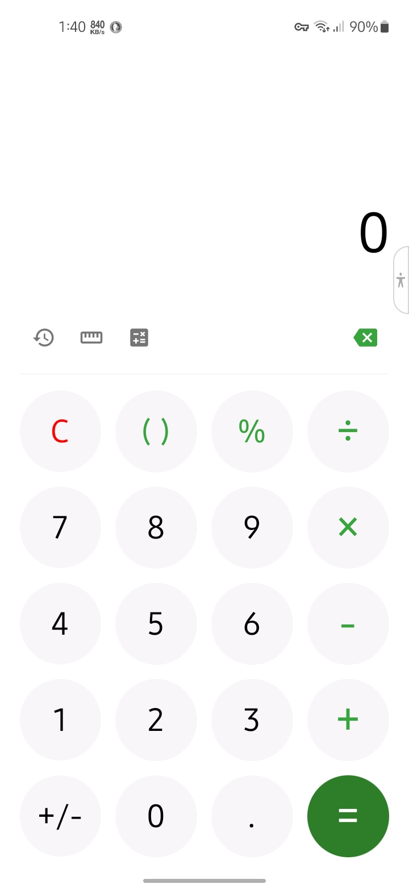
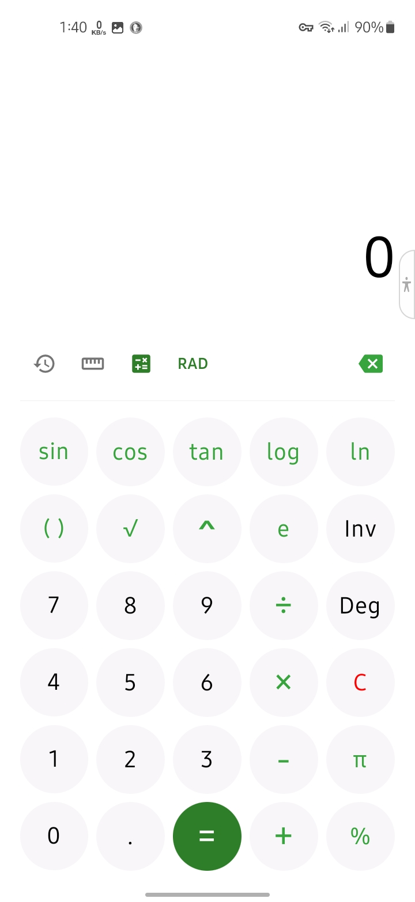
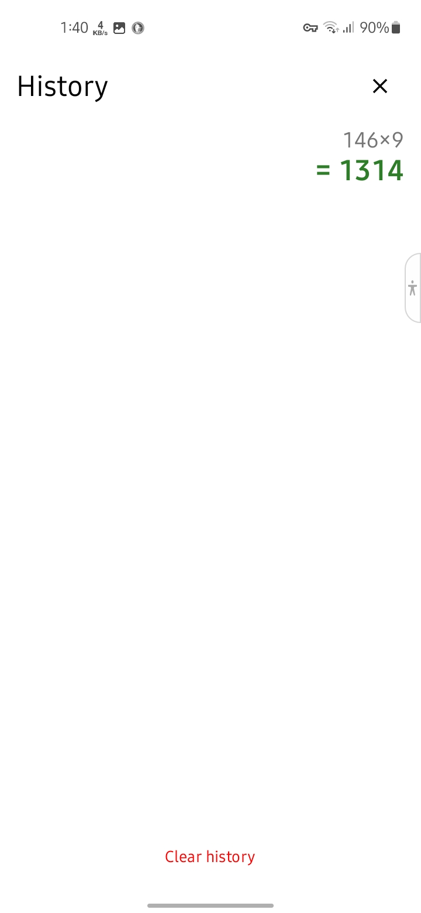
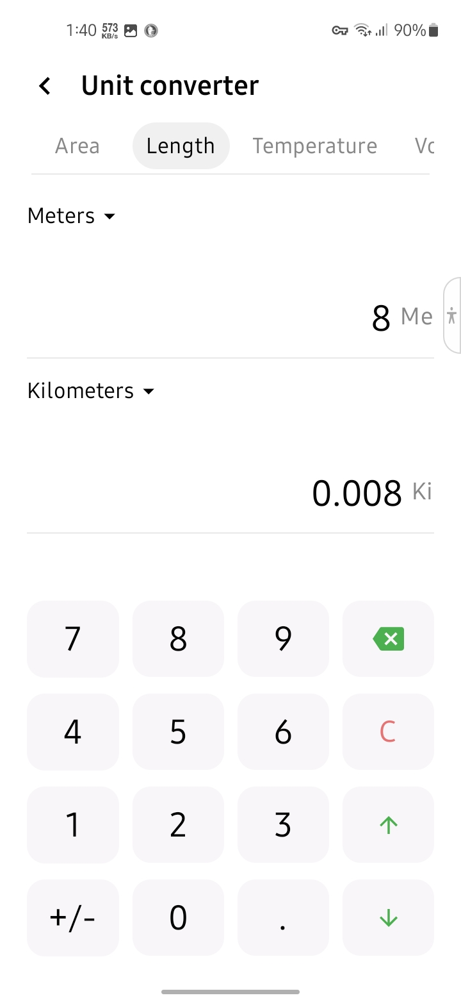
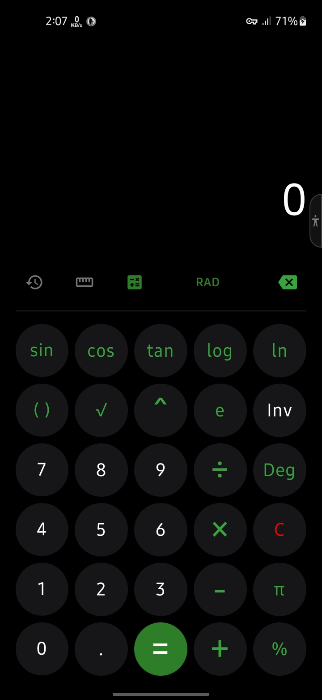

  # Samsung One UI Style Calculator

### A sleek, modern, and feature-rich Android calculator inspired by Samsung One UI.

Simple arithmetic, scientific calculations, unit conversions, and elegant design — all in one app.

  

---

## 📱 Screenshots

| Standard Mode | Scientific Mode | Calculation History |
|:---:|:---:|:---:|
|  |  |  |

| Unit Converter | Dark Mode |
|:---:|:---:|
|  |  |

---

## ✨ Features

* **Standard Calculator:** Perform basic operations like addition, subtraction, multiplication, and division with a clean interface.
* **Scientific Mode:** Access advanced functions including trigonometry (sin, cos, tan), logarithms (log, ln), and constants like Pi and Euler's number ($e$).
* **Unit Converter:** Easily convert Length (Meters to Kilometers), Area, Temperature, Volume and more.
* **Calculation History:** Keep track of your previous work so you never lose a result.
* **One UI Design:** Familiar Samsung-inspired interface with support for both **Light and Dark modes**.
* **Precision:** Toggle between Degrees and Radians for scientific calculations.

## 🛠 Installation

**Direct Download:** Get it on the [Google Play Store](https://play.google.com/store/apps/details?id=com.codingbyam.calculator).

## ⚙️ Requirements
* Android 9 or higher.
* Minimal storage footprint.

## 🚀 Why This Calculator?
* ✔ Clean Samsung One UI inspired design
* ✔ Lightweight and fast
* ✔ Scientific functions included
* ✔ Built-in unit converter
* ✔ Elegant dark mode support
* ✔ Smooth and responsive experience
